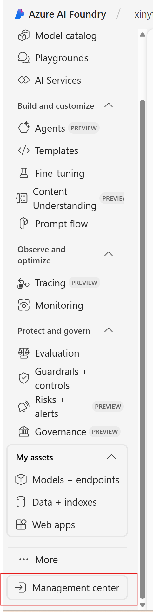
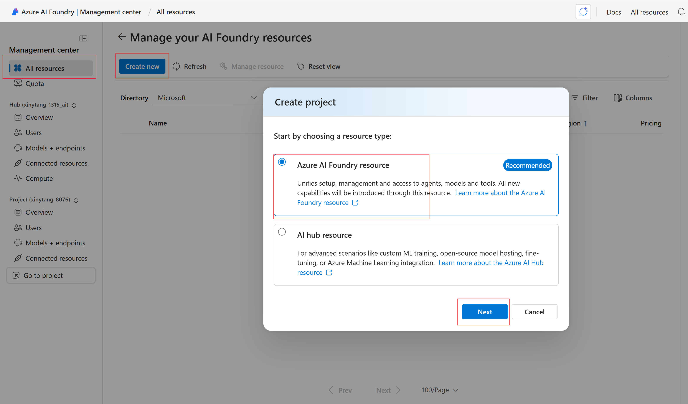
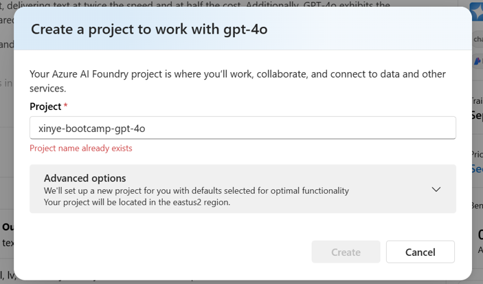
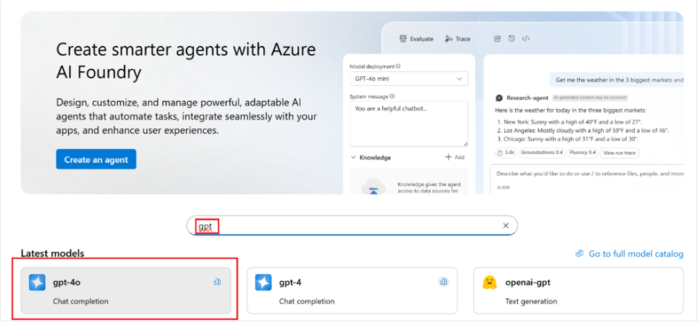
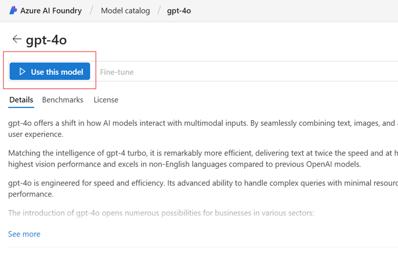
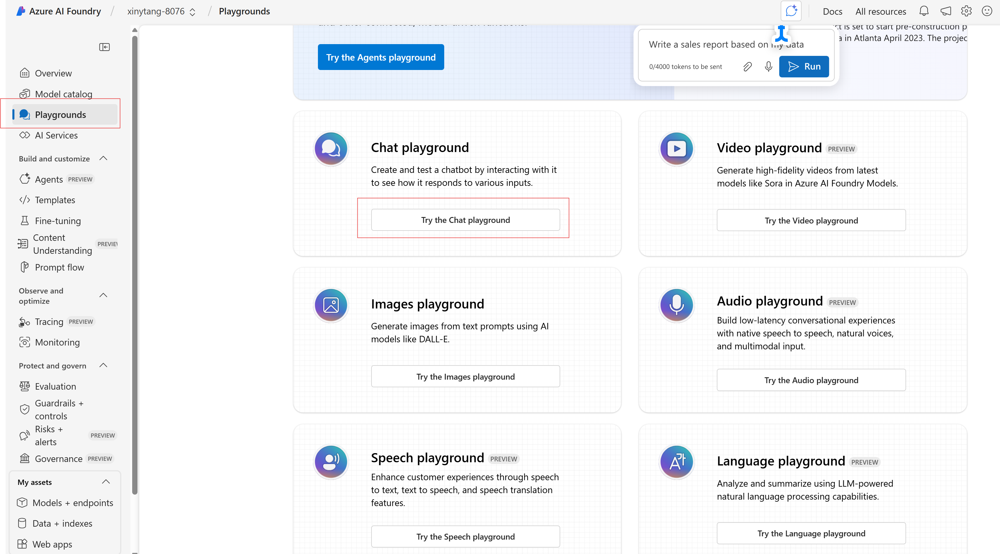
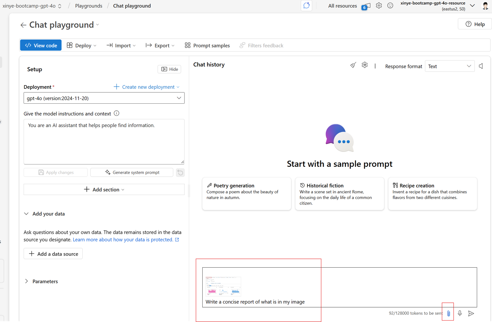
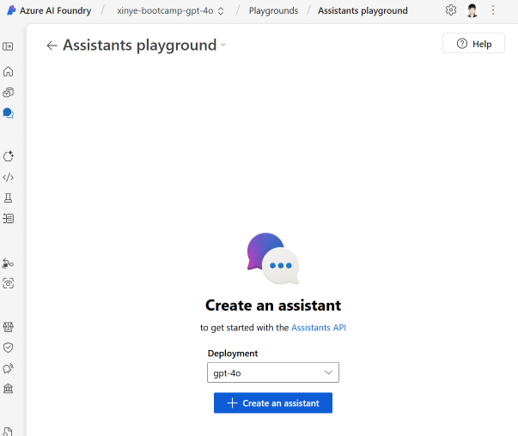
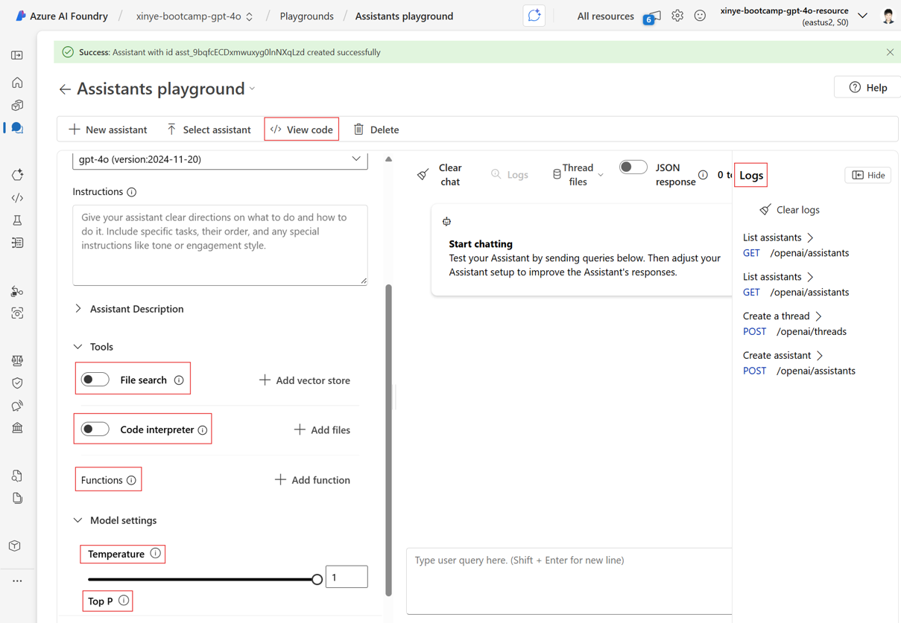

# 🧠 Azure AI Foundry Step-by-Step Tutorial

Welcome to your hands-on exploration of **Azure AI Foundry** with the **GPT-4o** model! This step-by-step guide will walk you through launching your first project, experimenting in the Chat Playground and  Assistants Playground.

---

## ✅ Prerequisites

- **Microsoft Azure account** with access to AI Foundry
- **Resource creation permissions** in your Azure subscription


---

## 🚀 Step 1: Set Up Your Project

1. Go to **Management center** on left panel.

2. Go to **All resources** on left panel. Click **Create new**, and select **Azure AI Foundry resource**.

3.**Name your project** and click **Create**.
   
4. On the home page, select **Model catalog** on left panel, **search for `gpt-4o`** and select the model from the results.
   
3. On the model’s detail page, click **Use this model**. Select **Direct from Azure models** as Purchase options.
   

---

## 💬 Section 1: Chat Playground


1. **Prepare an image**
   - Download an image from this folder.
2. Click **Playgrounds** on left panel, select **Try the Chat playground**. 

3. In the **Chat Playground**, **attach your image** to the chat input. Prompt GPT-4o with:
    ```
    Write a concise report of what is in my image.
    ```
   
4. **Customize model instructions or parameters** to see how the responses change:
    - Example model instruction:
    ```
    You are a helpful assistant that explains things in detail for beginners.
    ```
5. **Tune model parameters** in the left control panel:
- **Temperature**: For creative (higher) or precise (lower) responses.
- **Top P**: Another randomness control by limiting the model’s token choices to a probability mass.
- **Max response**: Caps total tokens in each response.
- **Stop sequences**: Define one or more token sequences where the model should end its output.
6. Reset your chat with the **Clear Chat** button if needed.
7. Use **View Code** to generate sample API request code that mirrors your setup (great for integration into apps or notebooks).

---

## 🛠️ Section 2 (Optional): Assistants Playground


1. On the AI Foundry home page, select the **GPT-4o model**, then click **Create an Assistant**.
   
2. Name your assistant and set its instructions, e.g.:
    ```
    You are a customer support bot for a retail website.
    ```

   
#### Enhance Your Assistant

##### 🔎 File Search

- Upload context documents (PDF, DOCX, TXT, etc.).
- The assistant uses **retrieval-augmented generation (RAG)** to ground answers in your uploaded content.
- Ideal for policy documents, manuals, or research paper.


##### 🧠 Code Interpreter (Python Environment)

- Enable **Code Interpreter** to run Python code live in the chat.
- Upload a file and ask:
  ```
  Analyze this CSV and show me a visualization of key trends.
  ```

#####  🧩 Functions (Custom API Calling):
- Add external API functions by specifying endpoints and parameter schemas.
- Example: A weather function with `{location, date}` as parameters.
- Call the function from chat:  
  ```
  What’s the weather in Seattle tomorrow?
  ```
- The LLM model will invoke the function and include the results in the response.

##### 🪵 Logs and History
- View full conversation logs for debugging or iteration.
- Inspect when functions are called, what parameters are passed, and what responses are returned.

##### 🧬 View Code for Deployment
- Like in the chat playground, every assistant has a **View Code** button.
- Use this to export the full assistant logic into a REST or SDK-based workflow.

---

## Reference
[Get started with Azure AI Foundry](https://learn.microsoft.com/en-us/azure/ai-foundry/quickstarts/get-started-code?tabs=azure-ai-foundry&pivots=fdp-project)
