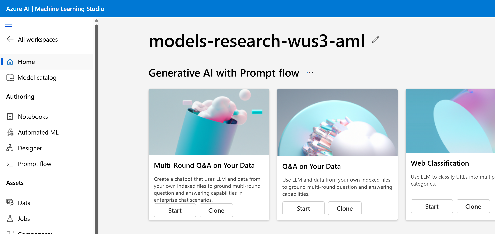
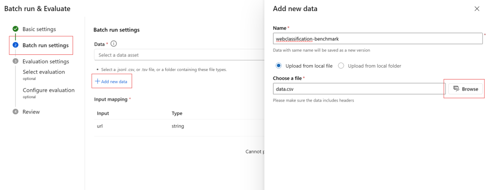

# AzureML Prompt Flow Step-by-Step Tutorial

Welcome to the GenAI Bootcamp hands-on session for **AzureML Prompt Flow**. In this tutorial, you'll go through a step-by-step guide to build, test, and evaluate prompt flows using Azure Machine Learning. This lab assumes you have completed the prerequisites below.

---

## Prerequisites

Before starting, please make sure you have completed the following:

### ✅ Create an Azure Machine Learning workspace

1. Sign in to [Azure Machine Learning Studio](https://ml.azure.com) and select **All workspaces**.
 
2. Select **Create workspace** and follow the prompts.
 

### ✅ Create a compute instance

1. Navigate to your Azure ML workspace.
2. On the top right, select **New** > **Compute instance**.
 
3. Enter a name for your instance.
4. Keep default values unless instructed otherwise.
5. Select **Review + Create** > **Create**.
 

### ✅ Create an Azure OpenAI resource

1. In the [Azure portal](https://portal.azure.com/), select **Create a resource** and search for **Azure OpenAI**.
2. Select **Create**.
3. Fill out the form and click **Next**.
 
4. On the **Network** tab, choose **All networks**.
5. Click **Next**, then **Review + submit**.
6. Once deployment completes, click **Go to resource**.
 

### ✅ Deploy a model

1. Sign in to [Azure AI Foundry portal](https://ai.azure.com).
2. Select the created Azure OpenAI resource.
2. Under **Shared resources** on the left menu, select **Deployments**.
3. Select **Deploy model** and then **Deploy base model**.
 

4. Select `gpt-4o` model from the list.
5. Click **Deploy**.
 

---

## Part 1: Add Azure OpenAI Connection

1. In [Azure Machine Learning Studio](https://ml.azure.com), open your workspace.
2. From the left menu, go to **Connections**.
3. Click **Connect**.
 
4. Choose **Azure OpenAI** as the connection type.
5. Select your deployed Azure OpenAI resource.
6. Use the default authentication and click **Add connection**.
 
7. Close the page after the connection is established.

---

## Part 2: Clone a Sample Flow

1. From the left menu, select **Prompt flow**. Select **Create** under **Flows** tab.
 
2. Browse the sample flows in the **Explore gallery**.
3. Click **Clone** on the **Web Classification** tile to create your own version.
 
---

## Part 3: Authoring Your Prompt Flow

1. On the flow authoring page, select **Start compute session**.
 
2. Familiarize yourself with the authoring interface:

   * **Flow**: The main canvas to edit nodes, prompts, inputs, and outputs.
   * **Files**: File explorer for the flow. You can create/upload/download files here.
   * **Graph**: Visual representation of the prompt flow pipeline.
   * Enable **Raw file mode** to edit code or prompts directly in files.
 

---

## Part 4: Run the Prompt Flow

1. For each LLM node (e.g., `summarize_text_content`, `classify_with_llm`), select your Azure OpenAI **Connection**.
 
2. To test a single node:

   * Click the **Run** icon on the node.
    
3. To test the entire flow:

   * Click the **Run** button on the top menu bar.
 

---

## Part 5: View Flow Outputs

1. Select **View outputs** on the top banner.
 
2. Review detailed execution information.
3. On the **Outputs** tab, check the predicted **category** and **evidence** for each input URL.
 

---

## Part 6: Evaluate with Test Data

1. Select **Evaluate** from the top menu.
2. On the **Basic settings** screen, enter a run name (optional), then click **Next**.
3. On the **Batch run settings** screen:

   * Click **Add new data**.
   * Upload the `data.csv` file from this folder.
   * Click **Add**.
    
4. On the **Select evaluation** screen:

   * Choose **Classification Accuracy Evaluation**.
    
5. On the **Configure evaluation** screen:

   * Map `groundtruth` to `${data.category}`.
   * Map `prediction` to `${run.outputs.category}`.
   * Click **Next**, then **Submit**.

 
---

## Part 7: Visualize Results

1. After submitting, go to **View run list**.
2. Wait for the batch run to complete.
3. Select the checkbox next to your run and choose **Visualize outputs**.
 
4. On the **Visualize outputs** screen:

   * Enable the eye icon to append results.

 
  

🎉 That's it! You've successfully created, tested, and evaluated a prompt flow in AzureML. Explore more flows or try authoring your own from scratch!

---

## References
[Create and deploy an Azure OpenAI](https://learn.microsoft.com/en-us/azure/ai-foundry/openai/how-to/create-resource?pivots=web-portal)
[Get started with prompt flow](https://learn.microsoft.com/en-us/azure/machine-learning/prompt-flow/get-started-prompt-flow?view=azureml-api-2)
[Create ML resources to get started](https://learn.microsoft.com/en-us/azure/machine-learning/quickstart-create-resources?view=azureml-api-2)