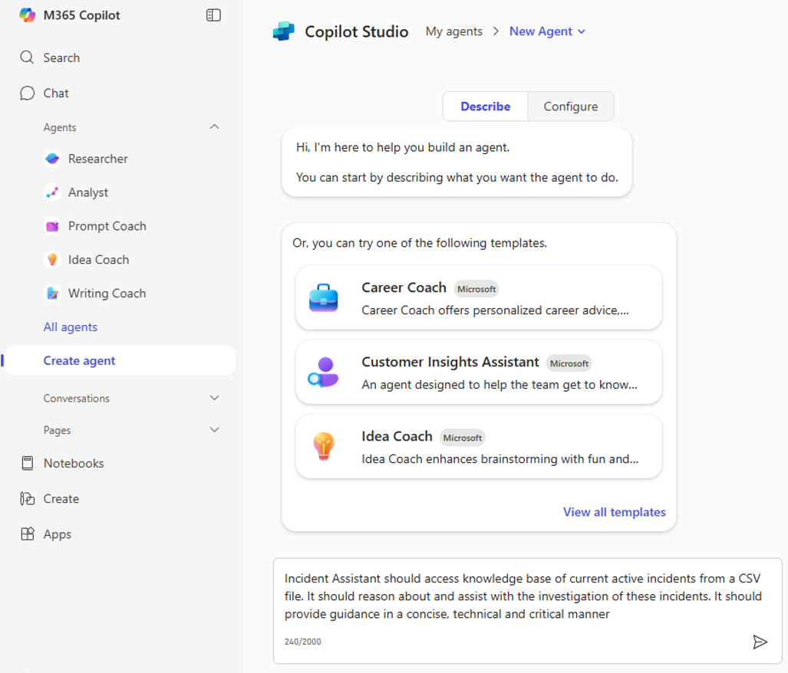
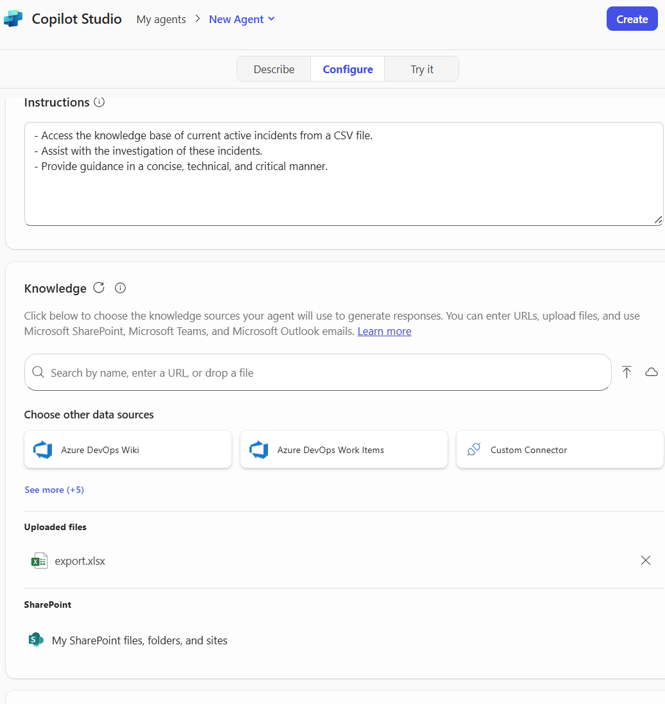
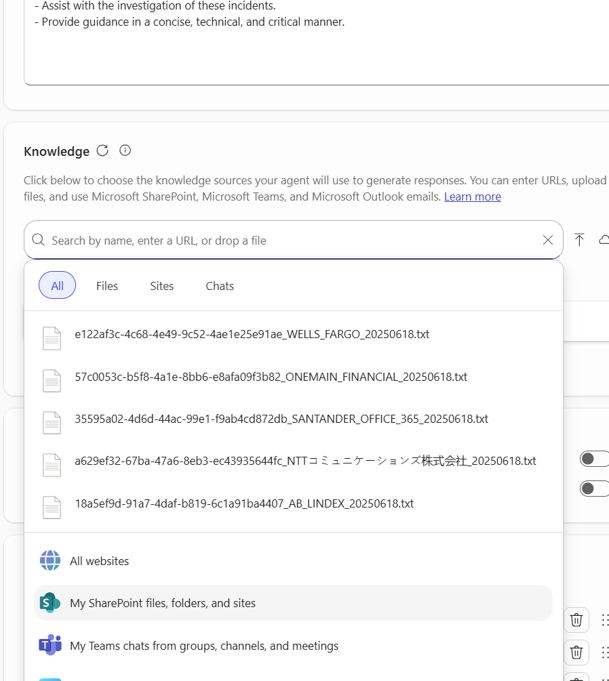
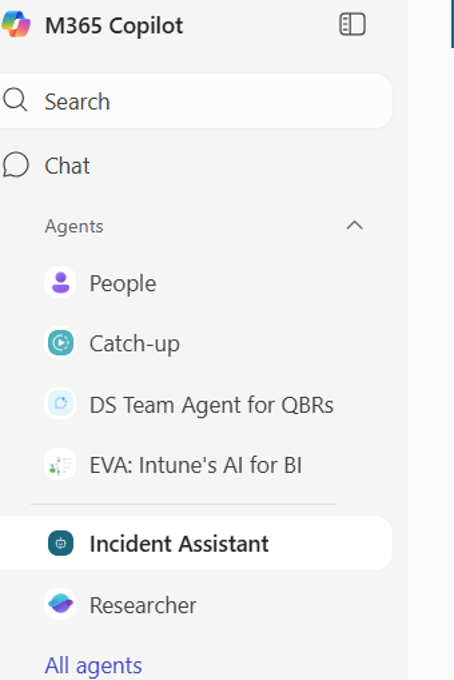
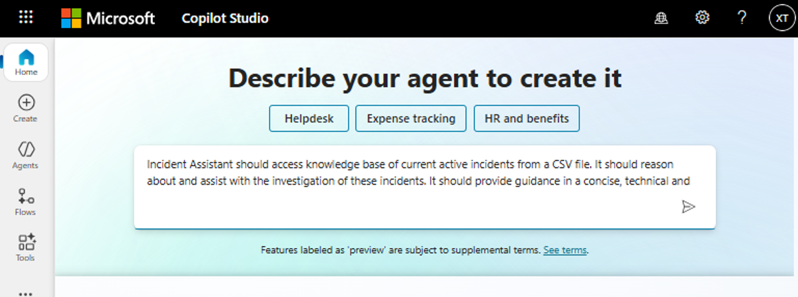
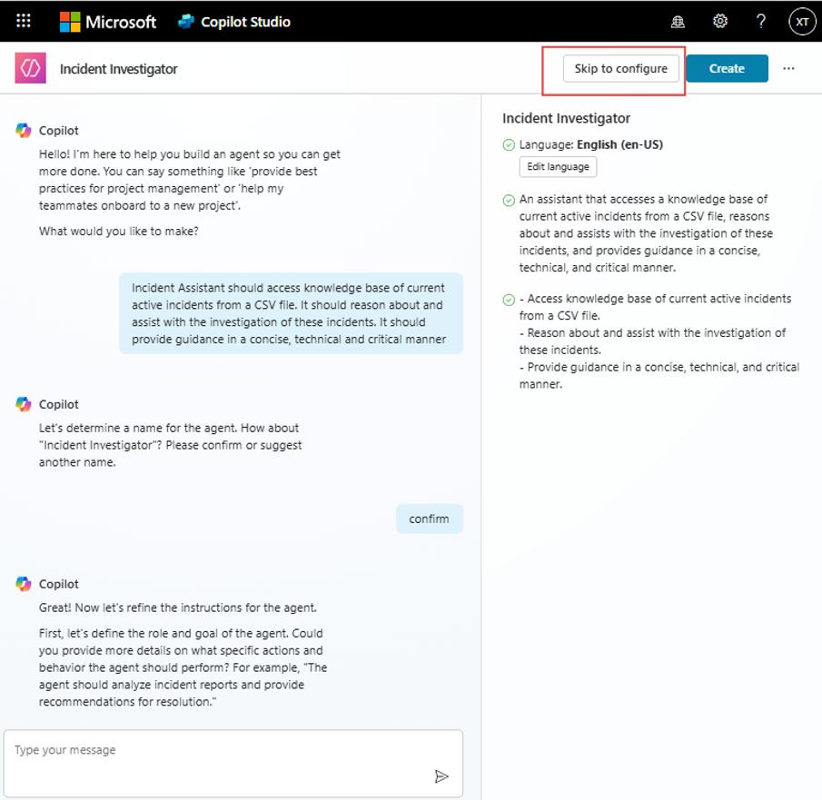
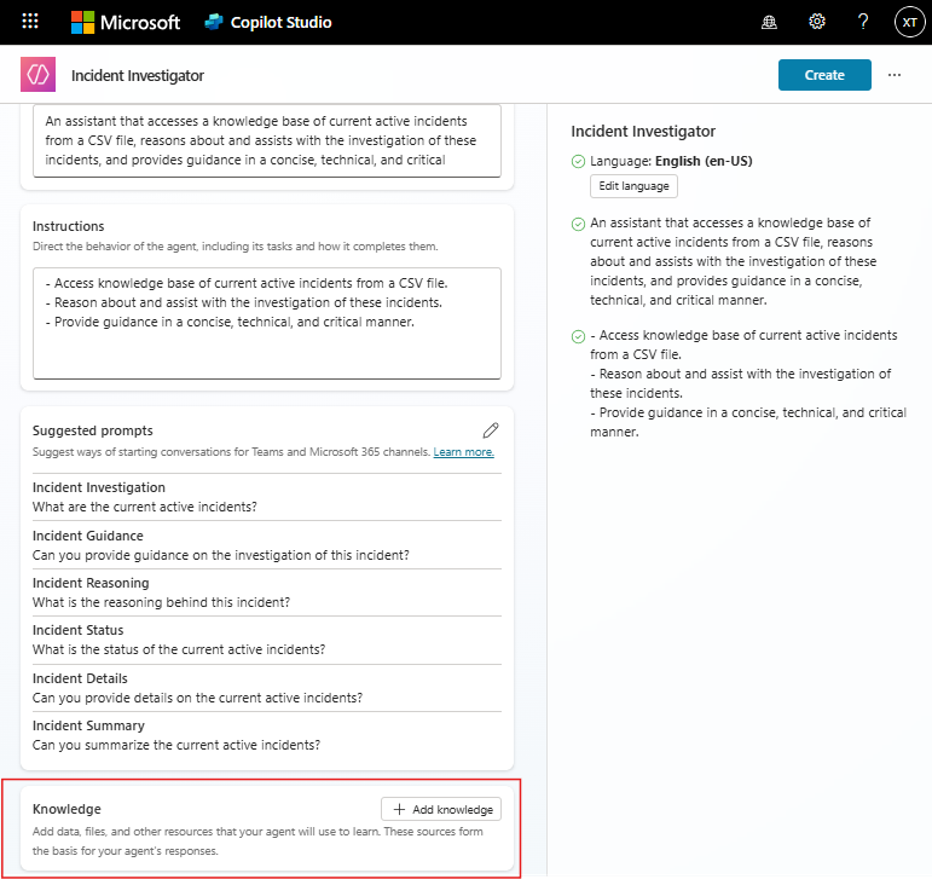

# 🚀 Copilot Studio Step-by-Step Tutorial

Welcome to the **GenAI Bootcamp** hands-on session for **Copilot Studio**!  
In this exercise, you'll build an AI-powered **Incident Assistant Agent** that can assist with analyzing and investigating ongoing incidents using structured knowledge from a CSV file.

---

## 🧰 What You’ll Need
- A Microsoft account (e.g., work or school)
- Access to [M365 Copilot Chat](https://m365.cloud.microsoft/chat/) or [Copilot Studio](https://copilotstudio.microsoft.com/)
- The provided data file: [`incident_data.xlsx`](./incident_data.xlsx)

---

## ✨ Objective

Create an AI agent that:
- Understands and reasons about incident data from a structured file
- Guides analysts through investigations with concise, technical, and critical insights

---

## Option 1: Use M365 Copilot Chat

### 📝 Step-by-Step

1. **Download the Data**  
   Download the file `incident_data.xlsx` from this folder.

2. **Open the M365 Copilot Portal**  
   Navigate to: [https://m365.cloud.microsoft/chat/](https://m365.cloud.microsoft/chat/)

3. **Create a New Agent**  
   Click on **"Create Agent"**.

4. **Describe the Agent’s Purpose**  
   Paste the following into the **Describe** box:

   > *"Incident Assistant should access knowledge base of current active incidents from a CSV file. It should reason about and assist with the investigation of these incidents. It should provide guidance in a concise, technical and critical manner."*

   

5. **Go to the Configure Tab**  
   After providing the description, go to the **Configure** tab.
   

6. **Connect Knowledge Base**  
   - Click on **Knowledge**
   - Upload your `incident_data.xlsx` file

7. **Create the Agent**  
   Click **Create** to finish setup.

8. **Test the Agent**  
   The new **Incident Assistant** will appear in the left-hand pane.  
   
   Click it and try asking questions like:
   - “What is the most urgent incident?”
   - “Which incidents have been open the longest?”

---

## 🔄 Alternative: Use Copilot Studio

Prefer working in **Copilot Studio** directly? Follow these instructions instead:

1. Go to [https://copilotstudio.microsoft.com/](https://copilotstudio.microsoft.com/)

2. Sign in with your Microsoft account
3. Click **"Create Copilot"**
4. In the **Describe** section, use the same description as above
5. Click **“Skip to configure”**

6. Upload the `incident_data.xlsx` under the **Knowledge** tab

7. Optionally connect channels such as **Email** and **Teams**
8. Test, publish, and invoke your agent from Teams' Copilot pane

---

## ✅ You're All Set!

Once your agent is live, try a few natural language prompts and explore how it reasons over the incident data. This hands-on task gives you a glimpse of how LLM agents can enhance real-world investigations with structured knowledge.

---

Happy building! 💡  
If you run into any issues, feel free to ask during the session or open an issue in this repo.

